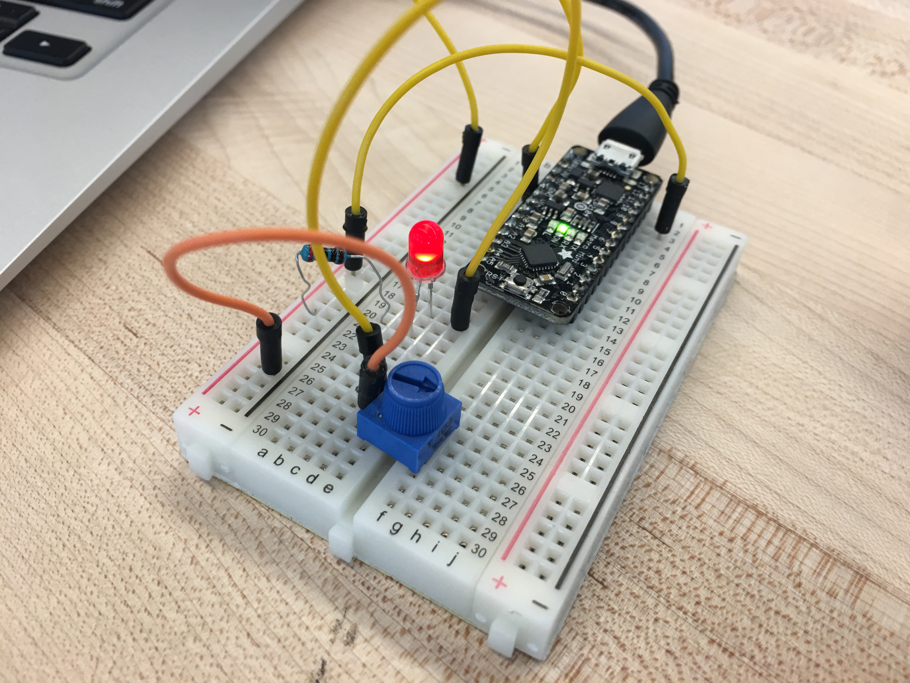
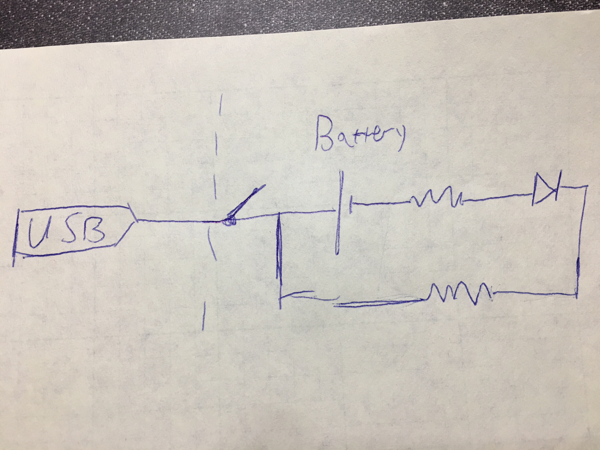
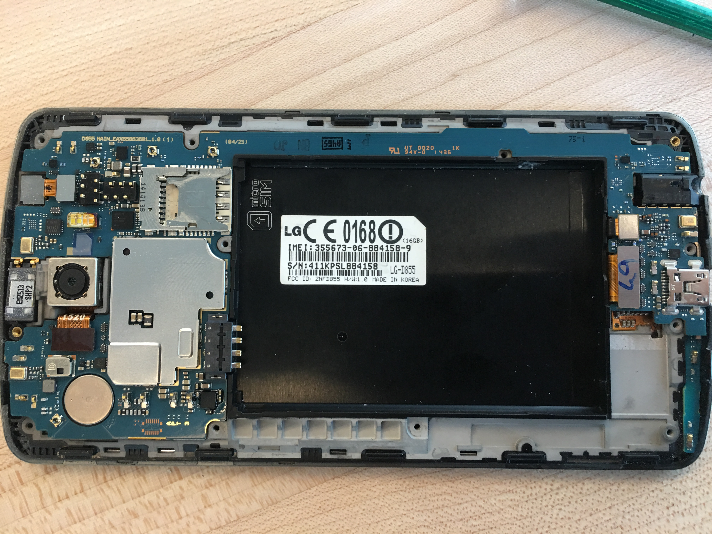
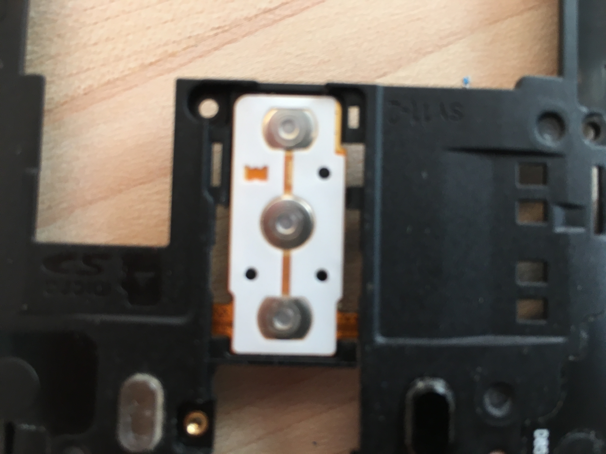

# IDD-Fa18-Lab1: Blink!

**A lab report by John Q. Student**

**Below is the lab report for the Lab 1 : Frankenlight**

## Part A. Set Up a Breadboard

## Part B. Manually Blink a LED

**a. What color stripes are on a 100 Ohm resistor?**
 
 There is a brown stripe, two black stripes, a red stripe and in between there there are green stripes. 
 
**b. What do you have to do to light your LED?**

After setting up the board as shown in the image above, I connected the USB cord to my laptop for a power supply and pressed the button. When the button is pressed, the light is on. 

## Part C. Blink a LED using Arduino

### 1. Blink the on-board LED

**a. What line(s) of code do you need to change to make the LED blink (like, at all)?**

I took the Blink example as is. 

**b. What line(s) of code do you need to change to change the rate of blinking?**

I changed the first delay and the second delay commands to affect the time during which the LED is on and off respectively. 

**c. What circuit element would you want to add to protect the board and external LED?**

The resistor, which I connect to the ground. 
 
**d. At what delay can you no longer *perceive* the LED blinking? How can you prove to yourself that it is, in fact, still blinking?**

After trying several different delay durations, starting from 50 miliseconds to 10 ms, the edge of my ability to see the blinking is around 12 ms. When I decrease the delay durations in one ms each time, it starts to look more and more constant. At 13 the eye can still see it's not completely constant. 

**e. Modify the code to make your LED blink your way. Save your new blink code to your lab 1 repository, with a link on the README.md.**

// the setup function runs once when you press reset or power the board, it is also uploaded to the repository
void setup() {
  // initialize digital pin LED_BUILTIN as an output.
  pinMode(LED_BUILTIN, OUTPUT);
}

// the loop function runs over and over again forever
void loop() {
  digitalWrite(LED_BUILTIN, HIGH);   // turn the LED on (HIGH is the voltage level)
  delay(100);                       // wait for a tenth of a second
  digitalWrite(LED_BUILTIN, LOW);    // turn the LED off by making the voltage LOW
  delay(10);                       // wait for a hudreth of second
}

### 2. Blink your LED

**Make a video of your LED blinking, and add it to your lab submission.**

https://youtu.be/1rtXOFfy4EU

## Part D. Manually fade an LED

**a. Are you able to get the LED to glow the whole turning range of the potentiometer? Why or why not?**

Yes, the LED lights from the point it has the most brightness to the point where it's almost turned off, because of the potentiometer. 

## Part E. Fade an LED using Arduino

**a. What do you have to modify to make the code control the circuit you've built on your breadboard?**

I need to modify the brightness, which is one of the parameters in the code (initially from the Fade example). 

**b. What is analogWrite()? How is that different than digitalWrite()?**

digitalWrite is binary: it's either HIGH or LOW, while analogWrite can have several distinct descrete options. 

## Part F. FRANKENLIGHT!!!

### 1. Take apart your electronic device, and draw a schematic of what is inside. 

**a. Is there computation in your device? Where is it? What do you think is happening inside the "computer?"**

Yes, since it is a smartphone, there is a chip right next to the battery. 

**b. Are there sensors on your device? How do they work? How is the sensed information conveyed to other portions of the device?**

There is a camera, a flashlight and LEDs, as well as the smartphone's screen. 

**c. How is the device powered? Is there any transformation or regulation of the power? How is that done? What voltages are used throughout the system?**

It has a Li-Ion battery of 3.8V, which can be charged using a USB cord. 

**d. Is information stored in your device? Where? How?**

Since it's a smartphone, there is a chip and it has memory. 

### 2. Using your schematic, figure out where a good point would be to hijack your device and implant an LED.

**Describe what you did here.**

I tried to look more closely at the button:

I tried to connect it to the Breadboard, without success, using one of the metal connectors. 

### 3. Build your light!

**Make a video showing off your Frankenlight.**

**Include any schematics or photos in your lab write-up.**
